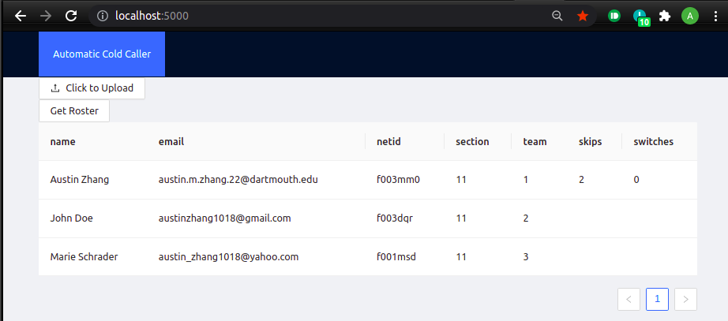
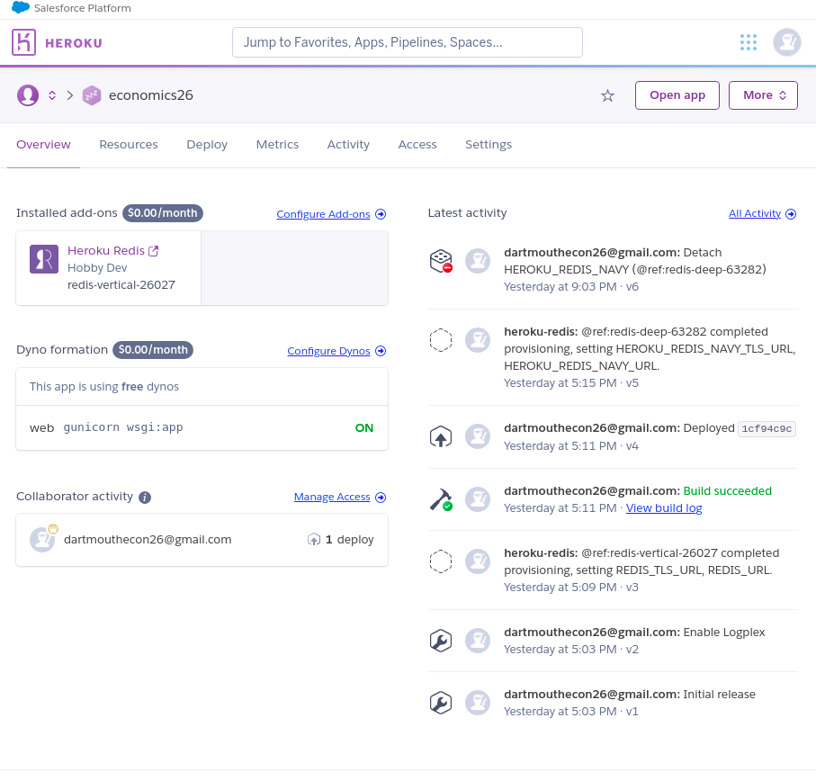

# Hack Technology / Project Attempted
For my hack I wanted to learn a few things. I wanted to learn how to use heroku to deploy an application, how to use redis with python, and how to use flask and integrate it with react.

## What you built? 

Last year I created a program for Econ 26 to automate cold calling for socratic seminar discussions as well as forming semi-random breakout groups. I've spent a good amount of time maintaining this program, as well as providing technical support, as in it's current form, it's a python CLI that the professor needs to run on his own computer. With this project, I'd like to move this CLI program into a web application, which will help me with both maintanibility and support, since I'll be able to update the program on my own without sending over files and users can simply access the functionality from their web browser without needing to download or install any software like python or its libraries.

I was able to finish building out part of the backend, including a file upload for updating the class roster, the database connections, and a route for retreiving the class roster. I also tested the heroku deployment to make sure that my flask service was properly working, as well as the flask-react integration. I wasn't able to finish integrating my existing CLI cold calling/breakout generation logic into the backend. I additionally finished setting up the redis database and the connections.

On the frontend, I was able to add a test button for getting the roster and logging to console. I created an upload button that connects to the backend to add a class roster to perform operations on. I also added a table for displaying the current status of students.

Included are some screenshots.

Frontend view

Heroku dashboard

## Who Did What?

Completed alone. All code except for that in `autocall.py` was created in the last week for this class.

## What you learned

I learned a lot about tools for rapid web development for this project. Previously I'd only used AWS as a cloud platform, and while it's very powerful, there's a lot of setup and configuration involved before you can get started with building out a project. With heroku, it was very easy to setup a service, and very simple to spin up companion services like redis as well. It was also nice that most of the configurations were built into the repo itself. I also learned a new simple python backend, flask. Previously, I'd only used node and node frameworks like koa and express as backends. Comparatively, flask was extremely simple to setup and use and I'll definitely be using this combination of Flask and Heroku again if I need to rapidly develop an app.

One thing I didn't like about Heroku was its ephemeral filesystem. I needed to store a very small CSV file < 1 mb, and to do so, I had to run an entire database because Heroku does not have local storage.

## Authors

Austin Zhang

## Acknowledgments
[Heroku Flask Deployment](https://dev.to/techparida/how-to-deploy-a-flask-app-on-heroku-heb)

[Heroku Redis](https://devcenter.heroku.com/articles/heroku-redis)

[Flask React Integration](https://towardsdatascience.com/build-deploy-a-react-flask-app-47a89a5d17d9)

[Ant Design Component Library](https://ant.design/docs/react/getting-started)

[Importing CSV into Flask](https://riptutorial.com/flask/example/32038/parse-csv-file-upload-as-list-of-dictionaries-in-flask-without-saving)

[Python Redis](https://realpython.com/python-redis/)

[Flask Requests](https://pythonbasics.org/flask-http-methods/)